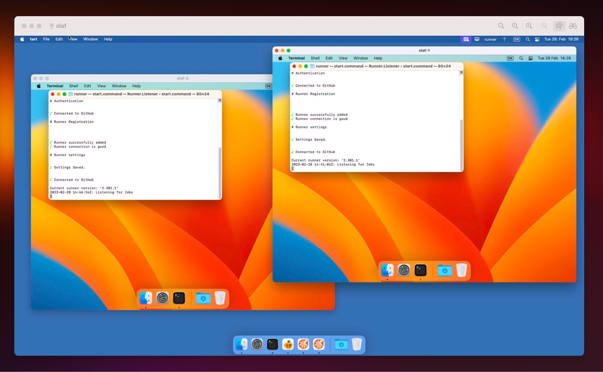

## 👋 Welcome to Tartelet - a macOS app that launches self-hosted GitHub Actions runners in virtual machines using [Tart](https://github.com/cirruslabs/tart).

Tartelet makes it a breeze to manage up to two GitHub Actions runners in ephemeral virtual machines on a single host machine. The benefits are that runners can run in parallel and each job runs in an isolated environment that is recreated after each GitHub Actions job has finished.

- [🚀 Getting Started](https://github.com/shapehq/tartelet#-getting-started)
- [👨‍🔧 How does it work?](https://github.com/shapehq/tartelet#-how-does-it-work)
- [🏎 How is the performance?](https://github.com/shapehq/tartelet#-how-is-the-performance)
- [👩‍💻 How can I contribute?](https://github.com/shapehq/tartelet#-how-can-i-contribute)
- [🤨 Why is it named Tartelet?](https://github.com/shapehq/tartelet#-why-is-it-named-tartelet)
- [🙏 Acknowledgements](https://github.com/shapehq/tartelet#-acknowledgements)

## 🚀 Getting Started

Please refer to the following articles in [the wiki](https://github.com/shapehq/tartelet/wiki) to get started with Tartelet.

- [Installing Tartelet](https://github.com/shapehq/tartelet/wiki/Installing-Tartelet)
- [Configuring Tartelet](https://github.com/shapehq/tartelet/wiki/Configuring-Tartelet)
- [Starting the Virtual Machines](https://github.com/shapehq/tartelet/wiki/Starting-the-Virtual-Machines)

## 👨‍🔧 How does it work?



Tartelet uses Tart for managing the virtual machines and Tart which in turn uses Apple's [Apple's Virtualization framework](https://developer.apple.com/documentation/virtualization). The lifecycle of a GitHub Actions runner managed by Tartelet is as follows:

1. Tartelet uses Tart to clone a virtual machine.
2. The virtual machine is booted.
3. After the machine is booted, a setup script is being run. The script downloads the newest version of [GitHub's runner application](https://docs.github.com/en/actions/hosting-your-own-runners/adding-self-hosted-runners) and registers the runner on the GitHub organization.
4. The runner listens for a job and executes it.
5. After executing the job, the runner automatically removes itself from the GitHub organization.
6. The virtual machine is shutdown.
7. Tartelet uses Tart to delete the virtual machine.

After the last step the process starts over.

## 🏎 How is the performance?

The performance depends on the hardware that the app is running on. When testing on a Mac mini M1 from 2020 with 16 GB memory, we found that our jobs run 3 - 4 times faster than on GtiHub's runners.

We found that our jobs run about 12% slower when running two virtual machines in parallel compared to running a single virtual machine. We find this performance cost negligible as running two virtual machines significantly increases our throughput at a low monetary cost.

It takes about 25 - 30 seconds to recreate and start a virtual machine. However, Tartelet is not creating the virtual machines on demand. After a job is finished, it will start a new virtual machine and have the GitHub Actions runner ready to process a job. Unless there are more jobs queued than the number of runners, the overhead of creating and booting a virtual machine becomes negligible.

These numbers were last updated in January/February 2023.

## 👩‍💻 How can I contribute?

Pull requests with bugfixes and new features are much appreciated. We are happy to review PRs and merge them once they are ready, as long as they contain changes that fit within the vision of Tartelet.

Clone the repository to get started working on the project.

```bash
git clone git@github.com:shapehq/tartelet.git
```

### Generating a Project File with XcodeGen

After cloning the repository you will notice that the project does not contain a .xcodeproj file. This should be generated using [XcodeGen](https://github.com/yonaskolb/XcodeGen). Install XcodeGen using [Homebrew](https://brew.sh) by running the following command in your terminal.

```bash
brew install xcodegen
```

After installing XcodeGen the project file can be generated by running the following command.

```bash
xcodegen generate
```

### Generating Resource Constants with SwiftGen

We use [SwiftGen](https://github.com/SwiftGen/SwiftGen) to generate constants for images, colors, and localizations. Install SwiftGen using [Homebrew](https://brew.sh) by running the following command in your terminal.

```bash
brew install swiftgen
```

Constants for images, colors, and localizations are then generated by running the following command in your terminal.

```bash
swiftgen
```

The `swiftgen.yml` file at the root of the repository describes how constants are generated.

### Linting the Codebase with SwiftLint

We use [SwiftLint](https://github.com/realm/SwiftLint) to ensure uniformity in the code. Install SwiftLint using [Homebrew](https://brew.sh) by running the following command in your terminal.

```bash
brew install swiftlint
```

## 🤨 Why is it named Tartelet?

The app is named Tartelet because it builds upon [Tart](https://tart.run), an open-source CLI for managing macOS virtual machines. Tartelet makes it easy to run multiple virtual machines using Tart. The Danish word for "easy" is "let". "Tart" + "e" + "le" = "Tartelet" and [a "tartelet" is a traditional Danish food.](https://www.valdemarsro.dk/tarteletter-hoens-asparges/)

## 🙏 Acknowledgements

- [Tart](https://github.com/cirruslabs/tart) does all the heavy-lifting of creating, cloning, and running virtual machines.
- Tartelet is heavily inspired by [Cilicon](https://github.com/traderepublic/Cilicon).

---

Tartelet is built with ❤️ by [Shape](https://shape.dk) in Denmark. Oh, and [we are hiring](https://careers.shape.dk) 🤗
